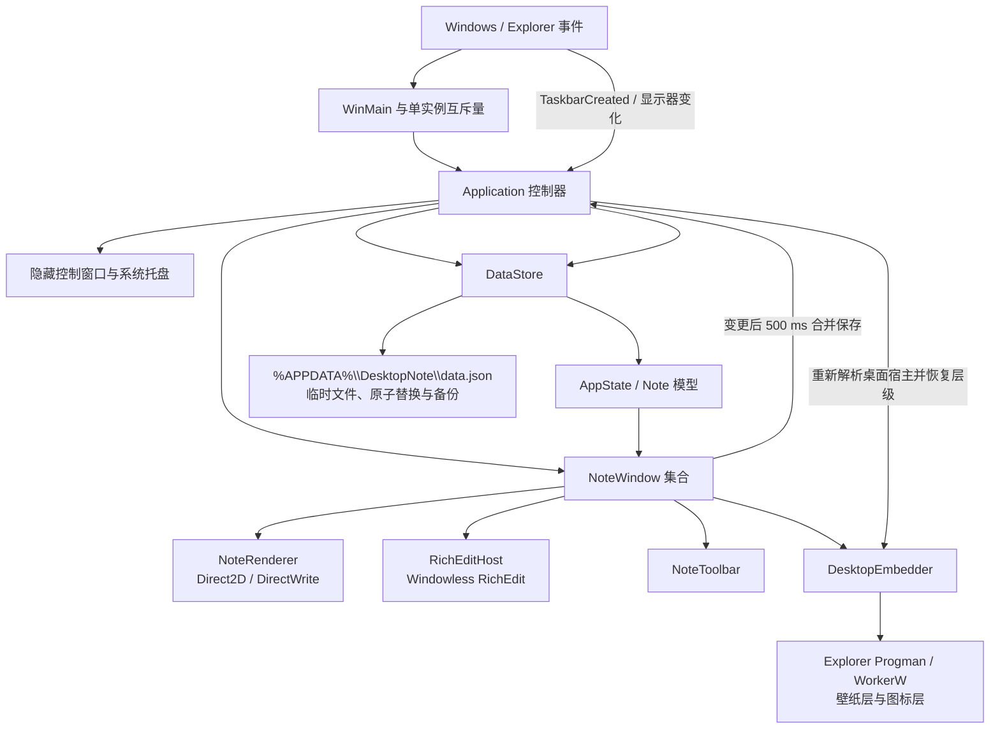

# DesktopNote 架构

DesktopNote 是单进程、单实例的原生 Win32 应用。界面、桌面层级和持久化都在本地完成；运行时只依赖 Windows 系统组件。

## 组件关系



## 关键设计不变量

### 桌面便签始终可见

“桌面嵌入”不是把便签变成 `WorkerW` 子窗口。便签保持无 owner 的顶层 `WS_POPUP` 窗口，`DesktopEmbedder` 每次动态解析 Explorer 当前的图标宿主和壁纸 `WorkerW`，再把便签放到壁纸层之上、桌面图标层之下。这样保留顶层窗口的合成与坐标语义，避免重设父窗口造成隐藏、裁剪或 Explorer 重启后句柄失效。

- 进入任何模式前先撤销旧的桌面层级状态。
- Explorer 重启、任务栏重建或显示器变化后重新解析宿主，不能缓存旧 `HWND`。
- 找不到完整的“图标层 + 壁纸层”时回退普通模式，不保存一个不可见的伪桌面状态。
- 重排层级时使用 `SWP_NOACTIVATE | SWP_SHOWWINDOW`，不抢焦点但保证窗口显示。

### 鼠标穿透只有一个状态入口

`NoteWindow::SetClickThrough` 是穿透状态的唯一写入口。它同步更新模型、顶层窗口扩展样式、RichEdit 只读状态、工具栏可见性和重绘：

- 开启时同时设置 `WS_EX_TRANSPARENT | WS_EX_NOACTIVATE`，并由 `WM_NCHITTEST` 返回 `HTTRANSPARENT`。
- 关闭时明确清除 `WS_EX_TRANSPARENT`；只有桌面模式继续保留 `WS_EX_NOACTIVATE`。
- 每次样式切换后用 `SWP_FRAMECHANGED` 让 User32 立即重新计算命中行为。
- 置顶模式与穿透互斥，切换为置顶会主动关闭穿透，避免形成无法操作的顶层窗口。

## 生命周期与数据流

```mermaid
sequenceDiagram
    participant User as 用户
    participant Note as NoteWindow
    participant App as Application
    participant Store as DataStore
    participant Shell as Explorer

    App->>Store: 启动加载 data.json 或迁移 data.dat
    Store-->>App: AppState
    App->>Note: 为每条 Note 创建窗口
    User->>Note: 编辑、移动或切换模式
    Note->>App: dirty 通知
    App->>Store: 500 ms 合并保存
    Store->>Store: 写临时文件、flush、原子替换
    Shell-->>App: TaskbarCreated / 显示器变化
    App->>Note: ReapplyDesktopMode
    Note->>Shell: 重新解析 WorkerW 并恢复层级
```

## 构建与验证边界

- `desktopnote_core`：模型、序列化、迁移、文件存储和通用 Win32 工具。
- `DesktopNote`：应用控制器、窗口、渲染器、RichEdit、工具栏和桌面层级。
- `DesktopNoteTests`：状态、迁移、备份和工具函数。
- `DesktopNoteRichEditTests`：RTF、剪贴板与编辑宿主。
- `DesktopNoteWindowTests`：窗口边界、响应式工具栏、桌面可见性和鼠标穿透；无交互 Explorer 会话的 CI 环境会明确跳过这一项桌面集成测试。
